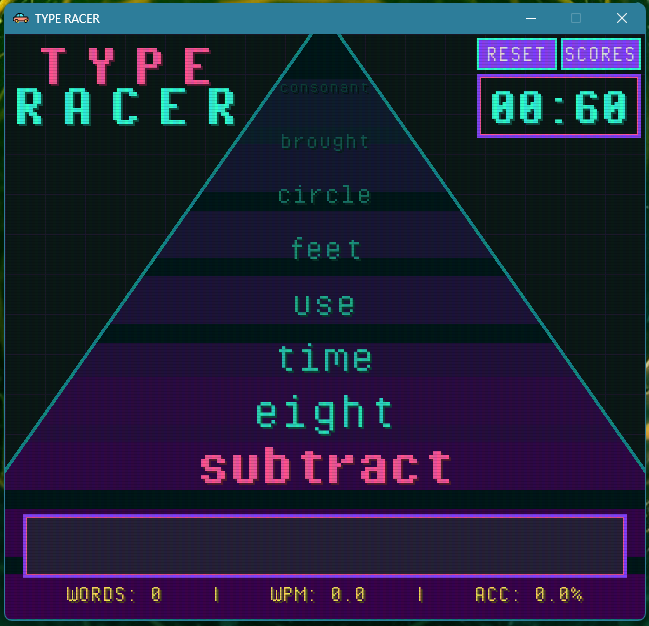

# TYPE RACER

A typing speed game with a retro CRT aesthetic, built with Pygame.

## Features

- **Retro CRT Visual Style**: Scanlines, phosphor glow effects, and vintage color palette
- **Real-time Metrics**: Track your Words Per Minute (WPM) and accuracy
- **Sound Effects**: Audio feedback for correct and incorrect words
- **1000 Common Words**: Practice with the most frequently used English words
- **Infinite Gameplay**: Words are shuffled and repeated endlessly

## Installation

1. Make sure you have Python 3.7+ installed
2. Install dependencies:
   ```bash
   pip install -r requirements.txt

### Controls

- **Type the word** you see highlighted at the top of the road
- **Press SPACE or ENTER** to submit your word
- **BACKSPACE** to delete characters
- **CTRL+R** to reset the game
- **ESC** to quit

### Gameplay

- Type each word as accurately and quickly as possible
- Your statistics (Words typed, WPM, Accuracy) update in real-time
- Green flash = correct word
- Red flash = incorrect word
- The road shows upcoming words in perspective


